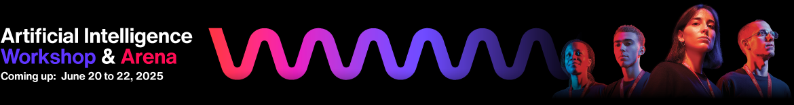

<!DOCTYPE html>
<html lang="en">
<head>
  <meta charset="UTF-8" />
</head>
<body>
  

  <h1>🎯 AIWA Hackathon – Starter Tech Pack</h1>

  

    This repository provides the official starter resources for the <strong>AIWA Hackathon</strong> — a 48-hour AI innovation event held in Safi, Morocco. It includes tools and setup guides to help participants efficiently prototype their ideas using modern web technologies and Salesforce’s AI & Data Cloud stack.
  

  <h2>🧰 What's Inside</h2>
  <ul>
    <li>🚀 <code>aiwa-cli</code>: A command-line tool to generate frontend/backend/fullstack starter projects</li>
    <li>🧠 <code>Salesforce Developer Pack</code>: Preconfigured Salesforce org with <strong>Agentforce</strong> and <strong>Data Cloud</strong></li>
    <li>📦 Example templates, documentation, and quick start guides</li>
  </ul>

  <h2>📂 Directory Structure</h2>
  <ul>
    <li><a href="./Aiwa-Cli.md">AIWA-CLI.md</a> – Full guide to using the AIWA CLI tool</li>
    <li><a href="./Salesforce-Starter.md">SALESFORCE-STARTER.md</a> – Guide to setting up your Salesforce Developer Org</li>
  </ul>

  <h2>💬 Need Help?</h2>
  
Reach out to the AIWA hackathon team during the event.

  

  
Made with 💙 by Aiwa Team

</body>
</html>
